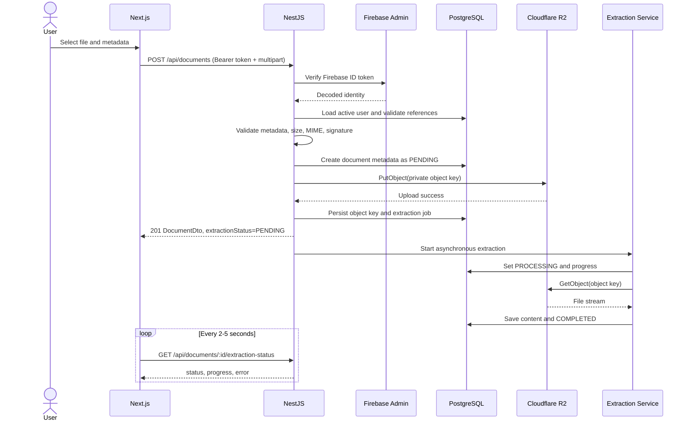

# Document Upload Workflow Integration Notes

Status: Reviewed
Owner: Le Dang Khoa
Jira: SCRUM-58
Related implementation: SCRUM-118 (Document/R2), SCRUM-119 (Extraction)

## Contract Decision

The browser uploads the file to NestJS. It never receives R2 credentials and
never uploads directly to Cloudflare R2.

```http
POST /api/documents
Authorization: Bearer <firebaseIdToken>
Content-Type: multipart/form-data
```

Required fields:

- `file`
- `title`: 1..200 characters
- `visibility`: `PRIVATE` or `PUBLIC`

Optional fields:

- `description`
- `subjectId`: UUID
- `categoryId`: UUID
- `tags`: maximum 10 strings

Success: `201 Created` with a `DocumentDto` containing the metadata, private
`objectKey`, and initial `extractionStatus`.

## Ownership and Authorization

| Action                     | Allowed actor                                         |
| -------------------------- | ----------------------------------------------------- |
| Upload                     | Active authenticated user                             |
| Read private metadata/file | Owner or admin                                        |
| Read public metadata/file  | Active authenticated user                             |
| Edit visibility/metadata   | Owner or admin                                        |
| Delete                     | Owner or admin                                        |
| Read extracted text        | Owner/admin; internal AI retrieval after access check |
| Retry extraction           | Owner or admin                                        |

Saved documents reference the original document. Saving must not duplicate the
R2 object.

## Object Key and Metadata

Recommended object key:

```txt
users/{ownerId}/documents/{documentId}/{sanitizedFileName}
```

PostgreSQL stores:

- object key in `Document.storagePath`
- original file name, type, and byte size
- owner, subject, category, visibility, status
- extraction status

Do not persist a permanent public URL. `Document.fileUrl` should remain null for
private R2 storage and can be removed in a later schema cleanup.

## Validation Order

1. Verify Firebase token.
2. Reject blocked/inactive users.
3. Validate multipart fields.
4. Validate extension and MIME allowlist.
5. Validate configured maximum size.
6. Validate file signature/structure.
7. Validate referenced subject/category records.
8. Allocate `documentId` and object key.

Use:

- `413` for size limit
- `415` for unsupported MIME/extension
- `422` for corrupt or signature-mismatched files
- `400` for invalid metadata

The frontend currently allows 20 MB while the extraction test endpoint uses a
10 MB constant. SCRUM-118 must replace both with one environment-backed upload
limit before the real upload endpoint is released.

## Upload and Extraction Sequence



The upload response must not wait for extraction.

## Consistency and Compensation

R2 and PostgreSQL do not share a transaction. Use compensating actions:

1. Create metadata/job in `PENDING`.
2. Upload to R2.
3. Persist the object key.
4. If R2 upload fails, mark the document/job `FAILED` or remove the provisional
   metadata in the same request.
5. If database persistence fails after R2 succeeds, attempt `DeleteObject` and
   log the orphan key for cleanup.
6. Never return `201` until metadata and object key are durable.

Repeated client upload requests are not automatically idempotent. A future
`Idempotency-Key` may be added if duplicate uploads become a problem.

## Preview and Download

Endpoints:

```txt
GET /api/documents/:id/preview
GET /api/documents/:id/download
```

Flow:

1. Verify token and active user.
2. Load the document.
3. Check owner/admin/public access.
4. Generate a short-lived presigned `GET` URL using
   `R2_PRESIGNED_URL_TTL_SECONDS` (default 300).
5. Return URL and `expiresAt`.
6. For download, create `DownloadLog` after authorization and before returning
   the URL.

Do not cache or store the presigned URL in PostgreSQL. Set response content
disposition to inline for preview and attachment with a sanitized original file
name for download.

## Extraction State and Retry

State transitions:

```txt
PENDING -> PROCESSING -> COMPLETED
                      -> MOCKED
                      -> FAILED
FAILED -> PENDING (manual retry with a new jobId)
COMPLETED -> PENDING (explicit re-extraction with a new jobId)
```

`POST /api/documents/:id/extract` is idempotent while the current job is
`PENDING` or `PROCESSING`; it returns the existing job. A retry after `FAILED`
creates a new `jobId`, clears previous error/progress fields, and returns
`202 Accepted`.

Polling:

- poll every 2-5 seconds
- stop at `COMPLETED`, `FAILED`, or `MOCKED`
- keep preview/download available when extraction fails
- Ask Document/Library returns `409` while required content is not completed

## Current Implementation Review

Already present:

- Firebase guard and PostgreSQL owner/admin checks
- `DocumentsModule` upload API and `StorageModule` R2 S3-compatible service
- extraction states, job IDs, progress, error code/message
- idempotent active extraction requests
- failed/completed re-extraction reset behavior
- extraction fetches stored R2 objects when no in-memory upload file is passed
- file signature checks for PDF/DOCX/PPTX/XLSX
- polling endpoint and Swagger DTOs

Gaps owned by SCRUM-118/SCRUM-119:

- upload endpoint is currently `POST /api/documents/upload`, not the approved
  `POST /api/documents` contract
- no preview/download authorization endpoints
- upload limit is not yet shared through environment configuration
- DOC/XLS legacy formats and website links are not implemented
- the in-memory extraction runner is not durable across process restarts

These gaps block an end-to-end upload test but do not change the approved
contract above.
